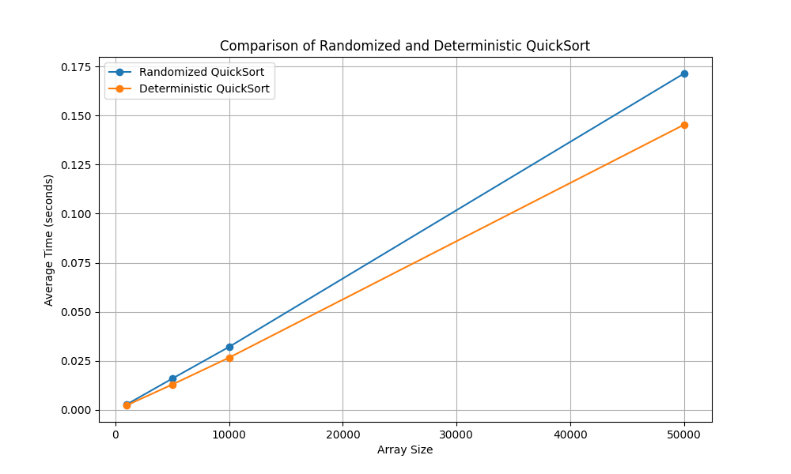

# goit-algo2-hw-10

## GOIT Design and Analysis of Algorithms Homework 10

### Requirements

- Python 3.10+
- Git

### Usage

Clone this repository:

```shell
git clone https://github.com/AntonChubarov/goit-algo2-hw-10.git
```

Navigate to project directory:

```shell
cd goit-algo2-hw-10
```

Install dependencies:

```shell
pip install -r requirements.txt
```

For Task 1 run the script:

```shell
python3 quick_sort.py
```

Review quicksort_comparison.png file.
Example:


For Task 2 run the tests:

```shell
python3 -m unittest
```

### Conclusions for Task 1

- For each array size tested (1000, 5000, 10000, and 50000), the deterministic QuickSort consistently achieved lower
average execution times compared to the randomized QuickSort.
- It is important to note that the sizes of the test arrays were intentionally kept lower than typical production sizes to
ensure that the tests would run more quickly. This choice helped in obtaining rapid feedback during experimentation.
- The slight advantage of deterministic QuickSort in these experiments may be attributed to the fixed pivot selection
method, which in these cases resulted in marginally faster performance. However, while deterministic QuickSort performed
better in these tests, randomized QuickSort is generally preferred in practice for its robustness against worst-case
scenarios, especially on larger or adversarial datasets.
